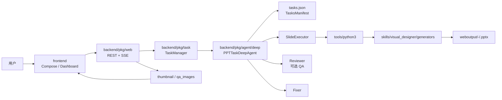

# PPT Agent 架构与变更活动范围

本文档基于 2026-08-03 对 `ppt-agent` 代码的阅读整理，目标是给后续变更定边界：改什么应该看哪些模块，哪些字段是跨层契约，验证应该落在哪里。

## 1. 系统定位

`ppt-agent` 是一个“Web 工作台 + Go 多 Agent 编排 + Python PPT 生成器”的 PPT 生成系统。核心链路是：

1. 前端选择模板/原子布局，形成 `TaskOutline`。
2. Go Web API 校验并补齐 outline，创建任务工作目录。
3. `TaskManager` 启动 Eino ADK Deep Agent，并通过 SSE 推送进度。
4. 主 Agent 生成/维护 `tasks.json`，按页调用 `SlideExecutor`。
5. `SlideExecutor` 读取 `tasks.json`，调用 Python `generators` 包生成单页 `.pptx`。
6. 后端轮询 `tasks.json` 和工作目录，发现 PPTX 后推送 `file_ready`，前端请求下载和缩略图。



## 2. 仓库分层

| 层级 | 主要路径 | 职责 | 后续改动边界 |
| --- | --- | --- | --- |
| Web 入口 | `ppt-agent/backend/main.go` | 读取 `.env`、初始化 logger/callback/skill/backend/db，组装 web/cli 两种启动模式 | 改服务启动、模型工厂、skill 路径、输出目录时看这里 |
| HTTP API | `ppt-agent/backend/pkg/web` | Gin 路由、认证、任务接口、模板接口、AI 补全、SSE、缩略图、继续对话 | 改前后端接口、任务创建、模板展示、下载/预览、继续生成时看这里 |
| 任务生命周期 | `ppt-agent/backend/pkg/task` | 创建任务、工作目录、运行态、SSE 事件缓存、DB 持久化、取消/删除、进度轮询 | 改状态机、并发限制、任务恢复、事件结构、持久化字段时看这里 |
| 多 Agent 编排 | `ppt-agent/backend/pkg/agent/deep` | 主 DeepAgent、SlideExecutor、Reviewer、Fixer、`tasks.json` 类型与读写 | 改生成流程、任务清单契约、QA/Fix、outline 直通、Agent prompt 时看这里 |
| Prompt 模板 | `ppt-agent/backend/pkg/prompts/deep` | 主 Agent、SlideExecutor、Reviewer、Fixer 指令 | 改模型行为、工具使用规则、字段语义、生成质量约束时必须同步这里 |
| 工具层 | `ppt-agent/backend/pkg/tools` | `read_file`、`edit_file`、`python3`、`search`、`batch_convert`、QA 等 Eino tool | 改工具能力、安全边界、转换行为、搜索策略时看这里 |
| 模板加载 | `ppt-agent/backend/pkg/templates` | 读取 full-deck/single-page JSON，暴露 theme/background | 改模板元数据、前端模板列表、后端 outline 校验时看这里 |
| 前端工作台 | `ppt-agent/frontend/src` | Vue 3 页面、API 类型、任务 Dashboard、模板编排、缩略图预览 | 改用户流程、展示状态、API 类型、SSE 消费时看这里 |
| PPT 生成器 | `ppt-agent/skills/visual_designer` | skill 说明、模板、生成器、素材、背景、转换脚本 | 改页面视觉质量、布局容量、生成参数、素材体系时看这里 |
| 评估/脚本 | `ppt-agent/scripts`、`docs/eval` | 本地评估、生成质量用例、辅助脚本 | 改质量回归、批量 smoke test、评估指标时看这里 |

## 3. 核心运行流程

### 3.1 Web 模式启动

入口是 `ppt-agent/backend/main.go`：

- `runWebMode` 将输出目录设为 `ppt-agent/weboutput`。
- `skillsDir` 指向 `ppt-agent/skills`，供 Eino skill backend、prompt 和 Python 生成器共同使用。
- `agentFactory` 为每个任务创建新的 `deep.PPTTaskDeepAgent`，注入 `WorkDir`、`TaskID`、`Operator`、`SkillsDir`、`RuntimeMeta`、模型工厂和并发数。
- `web.NewServer` 负责路由、模板 loader、任务管理器、风格画像、日志分析服务。

### 3.2 模板编排到任务创建

前端 `ComposePage.vue` 读取：

- `/api/templates`：预设 full-deck 模板。
- `/api/templates/layouts`：原子 single-page 布局。
- `/api/themes`：后端内置配色。
- `/api/backgrounds`：后端内置背景主题。

用户点击开始生成时，前端构造：

```ts
interface TaskOutline {
  template: string;
  theme: string;
  title: string;
  slides: {
    title: string;
    content_type: string;
    description: string;
    background?: string;
    content_plan?: ContentPlan;
  }[];
}
```

后端 `handleCreateTask` 会调用 `prepareOutline`：

- 校验 `content_type` 必须存在于 `templates/single-page/*.json`。
- `theme` 不存在时回退到 `ocean_soft`。
- `background` 不存在时清空。
- `description` 太短或缺少 `content_plan` 时，通过 `/api/ai/generate-outline` 同一套逻辑补齐。

### 3.3 `tasks.json` 是主协作契约

`backend/pkg/agent/deep/types.go` 定义 `TasksManifest` 和 `TaskItem`。这是主 Agent、子 Agent、后端轮询、前端进度展示之间最重要的共享状态。

```json
{
  "title": "PPT 标题",
  "theme": "ocean_soft",
  "template": "tech-intro",
  "tasks": [
    {
      "task_id": "slide-1",
      "page_index": 1,
      "title": "页面标题",
      "content_type": "content_slide",
      "description": "页面内容描述",
      "content_plan": {},
      "background": "",
      "output_file": "1_页面标题.pptx",
      "status": "pending"
    }
  ]
}
```

状态含义：

| 状态 | 含义 | 谁写入/消费 |
| --- | --- | --- |
| `pending` | 等待生成 | outline 转 manifest、主 Agent、继续生成 |
| `generating` | 生成中 | prompt 设计中有该状态，前端可展示 |
| `done` | PPTX 已生成 | 主 Agent 根据 SlideExecutor 汇总写入，后端轮询统计 |
| `qa_done` | 已质检且有 QA 报告 | Reviewer/主 Agent 写入 |
| `fixed` | 已修复 | Fixer/主 Agent 写入 |
| `failed` | 失败 | 前端类型已支持，部分 prompt 也要求失败标记 |

修改 `tasks.json` 相关逻辑时要同时看：

- `backend/pkg/agent/deep/types.go`
- `backend/pkg/task/manager.go`
- `backend/pkg/web/handler.go`
- `backend/pkg/prompts/deep/master_instruction.tmpl`
- `backend/pkg/prompts/deep/slide_executor_instruction.tmpl`
- `frontend/src/types.ts`
- `frontend/src/pages/DashboardPage.vue`
- `frontend/src/api.ts`

## 4. Agent 分工

### 4.1 主 Agent：`PPTTaskDeepAgent`

代码在 `backend/pkg/agent/deep/agent.go`，prompt 在 `backend/pkg/prompts/deep/master_instruction.tmpl`。

职责：

- 无 outline 时选 full-deck 模板并创建 `tasks.json`。
- 有 outline 时忠实执行后端已写入的 `tasks.json`。
- 按并发配置把页面分批调用 `SlideExecutor`。
- 根据子 Agent 结果更新单页状态。
- 可选调用 Reviewer/Fixer。
- 通过工具检查文件落地。

工具：

- `read_file`
- `edit_file`
- `search`
- `bash`
- `batch_convert`
- `task` 子 Agent 调用

风险点：

- Prompt 明确要求“禁止覆盖整个 `tasks.json`”，但工具本身是覆盖写文件；因此变更时要优先强化结构化 patch/manifest API，而不是只补自然语言约束。
- `content_type` 只能是生成器支持的英文 id。任何中文显示名都只能用于 UI。
- `description` 和 `content_plan` 是 SlideExecutor 的输入，不应塞超出布局容量的长段落。

### 4.2 SlideExecutor

代码在 `backend/pkg/agent/deep/slide_executor.go`，prompt 在 `slide_executor_instruction.tmpl`。

职责：

- 读取工作目录下的 `tasks.json`。
- 按 `content_type` 选择 `generate_xxx` 函数。
- 必须调用 `skills/visual_designer/generators` 包生成 PPT。
- 每个输出文件应是“一个 Presentation + 一个 slide + `save_slide`”。
- 不修改 `tasks.json` 状态，只报告成功/失败。

工具：

- `python3`
- `read_file`
- `search`

必须同步维护的权威资料：

- `skills/visual_designer/references/generators.md`
- `skills/visual_designer/generators/__init__.py`
- 对应 `generators/*_generator.py`
- 对应 `templates/single-page/*.json`

### 4.3 Reviewer / Fixer

Reviewer 是可选质量审查分支。当前 `newPPTTaskDeepAgent` 以 `cfg.EnableQA` 和路由 `SkipQA` 决定是否创建 Reviewer；`isQAEnabled()` 读取 `ENABLE_QA=true`，但 web/cli 的任务工厂当前没有显式给 `cfg.EnableQA` 赋值，因此默认运行路径仍是关闭 QA。若后续要恢复在线 QA，需要同时检查配置注入、环境变量和路由决策。代码在：

- `backend/pkg/agent/deep/reviewer.go`
- `backend/pkg/agent/deep/fixer.go`
- `backend/pkg/tools/qa`
- `backend/pkg/tools/batch_convert.go`

活动范围：

- 改视觉 QA 规则：看 Reviewer prompt、QA tool、PPTX 转 PDF/JPG 脚本。
- 改修复策略：看 Fixer prompt、生成器参数、`tasks.json.qa_report` 和 `fix_attempts`。
- 改默认成本策略：看 `isQAEnabled`、路由决策和环境变量。

## 5. 前端架构

前端是 Vue 3 + Composition API + Vite。

主要页面：

- `HomePage.vue`：入口页。
- `AuthPage.vue`：登录。
- `ComposePage.vue`：模板编排、AI 补齐、创建带 outline 的任务。
- `DashboardPage.vue`：任务列表、SSE、事件日志、进度、文件预览、继续对话。
- `AdminPage.vue`：用户/任务/日志分析管理。

主要组件：

- `Sidebar.vue`：任务列表侧边栏。
- `ProgressBar.vue`：进度、阶段、ETA。
- `EventLog.vue`：流式 answer/tool/error 展示。
- `SlidePreviewCard.vue`：单页缩略图、下载、预览。

SSE 消费重点：

| SSE 类型 | 前端用途 |
| --- | --- |
| `answer` | 追加事件日志和对话内容 |
| `tool_call` | 展示工具调用，推断 worker/batch |
| `progress` | 更新 `taskItems`、`doneCount`、`totalCount`、phase |
| `file_ready` | 将 PPTX 加入 `finalFiles`，触发缩略图/下载可用 |
| `token_usage` | 更新 token 用量 |
| `runtime_meta` | 更新开发者状态栏和 timeline |
| `error` | 展示错误日志 |
| `complete` | 停止轮询，写最终状态 |
| `continue_queued` / `continue_complete` | 继续对话流程 |

改 SSE 事件字段时必须同步：

- `backend/pkg/task/manager.go` 的 `SSERichEvent`
- `backend/pkg/web/streamer.go`
- `frontend/src/types.ts`
- `frontend/src/pages/DashboardPage.vue`

## 6. PPT 生成器架构

`skills/visual_designer` 是生成器和模板系统的根。

| 路径 | 作用 |
| --- | --- |
| `SKILL.md` | 视觉原则、内容充实度、背景和素材策略 |
| `references/generators.md` | SlideExecutor 调用生成器的参数权威来源 |
| `references/palettes.md` | 配色说明 |
| `templates/full-decks/*.json` | 前端预设模板列表和默认页面结构 |
| `templates/full-decks/*.py` | 主 Agent 读取的模板结构/设计参考 |
| `templates/single-page/*.json` | 原子布局元数据、字段、容量 contract |
| `templates/single-page/*.py` | 单页设计规范参考 |
| `generators/__init__.py` | 生成器导出注册面 |
| `generators/base.py` | 底层版式、文本、背景、保存 helper |
| `generators/layout_intelligence.py` | 内容密度、动态字号、版面平衡 |
| `generators/asset_manager.py` | 本地素材 manifest 读取 |
| `assets/manifest.json` | 本地图标、背景、纹理索引 |
| `background_templates/` | 主题背景预览和资源 |

生成器改动的同步规则：

1. 新增 `content_type`：同步 `single-page/*.json`、`full-decks/*.json`、对应 generator、`generators/__init__.py`、`references/generators.md`、前端 `contentTypeLabels`。
2. 改生成器参数：同步 `references/generators.md`、SlideExecutor prompt、模板 JSON contract、测试样例。
3. 改背景主题：同步 `templates.Loader.loadBackgrounds`、`background_templates` 资源、`background_manager.py` palette 映射、前端背景展示。
4. 改视觉质量 helper：重点验证所有受影响模板，避免只看单页。

## 7. 按变更类型选择活动范围

| 变更类型 | 必看文件 | 典型验证 |
| --- | --- | --- |
| 新增/修改模板预设 | `skills/visual_designer/templates/full-decks/*.json`、对应 `.py`、`backend/pkg/templates/loader.go`、`frontend/src/pages/ComposePage.vue` | 模板 JSON 解析、前端模板加载 |
| 新增原子布局 | `templates/single-page/*.json/.py`、`generators/*_generator.py`、`generators/__init__.py`、`references/generators.md`、`frontend/src/pages/ComposePage.vue` | `py_compile`、单页生成、前端 layout 列表 |
| 改 PPT 视觉质量 | `SKILL.md`、`generators/base.py`、具体 generator、`layout_intelligence.py`、模板 contract | 相关模板 PPTX 生成、PDF/PNG 渲染检查 |
| 改内容规划质量 | `pkg/web/handler.go` 的 outline 补齐、`pkg/prompts/deep/*.tmpl`、模板 contract | 后端相关测试、手工 outline JSON 样例 |
| 改任务状态/进度 | `pkg/task/manager.go`、`pkg/agent/deep/types.go`、`pkg/web/streamer.go`、`frontend/src/types.ts`、`DashboardPage.vue` | Go 单元测试、SSE 手工/最小任务 |
| 改下载/缩略图 | `pkg/web/handler.go`、`thumbnail.go`、`tools/batch_convert.go`、`SlidePreviewCard.vue` | 单文件下载、缩略图 404/503/成功路径 |
| 改继续对话/再生成 | `pkg/web/handler.go` 的 continue 分支、`pkg/task/manager.go`、`pkg/agent/deep/run.go`、`DashboardPage.vue` | 运行中排队、完成后继续、指定页再生成 |
| 改模型/fallback/token | `pkg/agent/utils/model.go`、`compressor.go`、`runtime_meta.go`、`main.go` | 聚焦 Go 测试、无凭据时说明不可跑真实模型 |
| 改认证/管理后台 | `pkg/auth`、`pkg/db`、`pkg/web/middleware.go`、`frontend/src/stores/auth.ts`、`AdminPage.vue` | 登录/鉴权路径、DB 可用性 |
| 改日志分析/观测 | `pkg/log_analysis`、`pkg/agent/utils/runtime_meta.go`、`DashboardPage.vue` timeline | 后端单测、前端 build |

## 8. 高风险契约

### 8.1 `content_type`

`content_type` 是跨层稳定 id：

- 前端用它选择布局和展示中文名。
- 后端用它校验 outline。
- Prompt 用它选择生成器。
- Python 用它映射 `generate_xxx`。

不要把中文 display name 写入 `content_type`。新增 id 时必须从前端到生成器全链路同步。

### 8.2 `description` 与 `content_plan`

`description` 是自然语言内容输入，`content_plan` 是结构化辅助输入。两者应受模板容量控制：

- `content_slide`：4-6 条短要点。
- `chart_slide`：必须有 labels/datasets。
- `kpi_dashboard`：必须有 value/label/delta/baseline。
- `image_text`：允许较长 paragraph。

不要让 SlideExecutor 同时承担“搜索、长文抽取、结构化、排版、校验”全部压力。能在 outline 阶段结构化的内容，应尽早结构化。

### 8.3 背景与配色

`background` 是可选主题 id，不是图片路径。它跨越：

- 前端背景选择。
- 后端背景 id 校验。
- Prompt 背景推断。
- 生成器 `background` 参数。
- `background_manager.py` 中的 palette 映射。

信息密集页默认保持干净背景；封面、章节、引用、总结等低密度页才优先使用背景。

### 8.4 工作目录产物

每个任务工作目录通常包含：

- `tasks.json`
- 单页 `.pptx`
- `qa_images/*.jpg`
- `merged.pdf`
- `runtime_events.jsonl`
- `runtime_report.json`

不要在无关变更中清理或提交这些产物。前端下载和缩略图只依赖文件名与后端安全路径拼接。

### 8.5 工具安全边界

`python3` 工具会把模型生成代码写成临时 `.py` 并执行，已有大小、危险模式和超时限制，但它不是完整沙箱。涉及执行能力时要关注：

- `backend/pkg/tools/python_runner.go`
- `backend/pkg/tools/pythonutil`
- `backend/pkg/agent/command/operator.go`
- 工作目录限制和输出文件检查

`edit_file` 是覆盖写工具，当前依赖 prompt 约束避免整体覆盖 `tasks.json`。如果后续要提高可靠性，优先考虑专门的 manifest patch 工具。

## 9. 验证矩阵

按风险选最小验证：

| 改动范围 | 推荐命令 |
| --- | --- |
| 后端任务/API/Agent | `go test ./pkg/web ./pkg/task ./pkg/agent/deep` |
| 后端公共工具/模型 | `go test ./pkg/agent/utils ./pkg/tools/...` 或更小包 |
| 后端编译面 | `go build ./...` |
| 前端 API/types/UI | `npm run build` |
| Python 生成器语法 | `python -m py_compile skills/visual_designer/generators/*.py` |
| 具体模板视觉 | 生成相关单页 PPTX，再用 LibreOffice/Poppler 渲染 PNG 检查 |
| OpenSpec 变更 | `openspec validate <change> --strict` |

不要默认跑高成本真实 LLM 任务。若验证依赖 MySQL、模型凭据、LibreOffice 或 Poppler，不可用时在最终说明中写清楚阻塞条件。

## 10. 后续演进建议

1. 给 `tasks.json` 增加结构化 patch 工具，减少 LLM 直接覆盖 JSON 的风险。
2. 将 `templates/single-page/*.json` 的 `contract` 用于后端 outline 补齐和布局选择，而不是只作为展示元数据。
3. 统一 `content_type -> generator` 映射表，避免 prompt、文档和 Python 导出面分散维护。
4. 为缩略图转换建立明确状态字段，让前端区分“PPTX 未生成”“缩略图转换中”“转换失败”“文件不存在”。
5. 将生成器 smoke test 固化为脚本，覆盖所有 single-page 模板的 PPTX/PDF/PNG 视觉回归。
