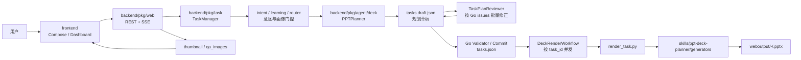

# PPT Agent 架构与变更活动范围

本文档基于 2026-08-12 对 `ppt-agent` 代码的阅读整理，目标是给后续变更定边界：改什么应该看哪些模块，哪些字段是跨层契约，验证应该落在哪里。

## 1. 系统定位

`ppt-agent` 是一个“Web 工作台 + Go 多 Agent 编排 + Python PPT 生成器”的 PPT 生成系统。核心链路是：

1. 前端直接提交智能规划请求，或在自定义编排中选择合法页面类型形成 `TaskOutline`。
2. Go Web API 校验并补齐 outline，创建任务工作目录。
3. `TaskManager` 完成意图识别、用户画像门控和路由决策，并通过 SSE 推送进度。
4. `PPTPlanner` 无论有无 outline，都通过 `update_tasks_manifest` 一次性生成完整 `tasks.draft.json`。
5. `TaskPlanReviewer` 根据 Go 硬校验报告批量修正草稿，Go 最多执行三轮并在通过后提交 `tasks.json`。
6. `DeckRenderWorkflow` 按 `task_id` 并发调用 Python `render_task.py`，由 `generators` 包生成单页 `.pptx`。
7. 后端轮询 `tasks.json` 和工作目录，发现 PPTX 后推送 `file_ready`，前端请求下载和缩略图。



## 2. 仓库分层

| 层级 | 主要路径 | 职责 | 后续改动边界 |
| --- | --- | --- | --- |
| Web 入口 | `ppt-agent/backend/main.go` | 读取 `.env`、初始化 logger/callback/skill/backend/db，组装 web/cli 两种启动模式 | 改服务启动、模型工厂、skill 路径、输出目录时看这里 |
| HTTP API | `ppt-agent/backend/pkg/web` | Gin 路由、认证、任务接口、模板接口、AI 补全、SSE、缩略图、继续对话 | 改前后端接口、任务创建、模板展示、下载/预览、继续生成时看这里 |
| 任务生命周期 | `ppt-agent/backend/pkg/task` | 创建任务、工作目录、运行态、SSE 事件缓存、DB 持久化、取消/删除、进度轮询 | 改状态机、并发限制、任务恢复、事件结构、持久化字段时看这里 |
| 规划与渲染编排 | `ppt-agent/backend/pkg/agent/deck` | `PPTPlanner`、`TaskPlanReviewer`、`PPTFixer`、manifest 草稿/提交、规划恢复、按页渲染 workflow | 改生成主流程、任务清单契约、规划质量门、继续修复或 Agent prompt 时看这里 |
| Prompt 模板 | `ppt-agent/backend/pkg/prompts/{planner,reviewer,fixer}` | 首轮规划、规划质量修正和生成后定点修复的独立指令 | 改模型行为、工具使用规则、字段语义、生成质量约束时必须同步这里 |
| 工具层 | `ppt-agent/backend/pkg/tools` | 当前 Agent 只注册 `read_file`、`search`、`search_images`；转换脚本属于确定性基础设施 | 改工具能力、安全边界、搜索策略时看这里 |
| 模板加载 | `ppt-agent/backend/pkg/templates` | 读取 `component_contracts.json` 页面类型契约和 theme 元数据 | 改页面类型元数据、前端 layout 列表、后端 outline 校验时看这里 |
| 前端工作台 | `ppt-agent/frontend/src` | Vue 3 页面、API 类型、任务 Dashboard、模板编排、缩略图预览 | 改用户流程、展示状态、API 类型、SSE 消费时看这里 |
| PPT Deck Planner 与生成器 | `ppt-agent/skills/ppt-deck-planner` | Skill 说明、组件契约、生成器、图片落盘契约和测试 | 改页面视觉质量、布局容量、生成参数、素材体系时看这里 |
| 评估/脚本 | `ppt-agent/scripts`、`docs/eval` | 本地评估、生成质量用例、辅助脚本 | 改质量回归、批量 smoke test、评估指标时看这里 |

## 3. 核心运行流程

### 3.1 Web 模式启动

入口是 `ppt-agent/backend/main.go`：

- `runWebMode` 将输出目录设为 `ppt-agent/weboutput`。
- `skillsDir` 指向 `ppt-agent/skills`，供 Eino skill backend、prompt 和 Python 生成器共同使用。
- `agentFactory` 为每个任务创建新的 `deck.NewPPTPlannerAgent`，注入 `WorkDir`、`TaskID`、`Operator`、`SkillsDir`、`RuntimeMeta`、模型工厂和并发数。
- `web.NewServer` 负责路由、模板 loader、任务管理器、风格画像、日志分析服务。

### 3.2 智能规划 / 自定义编排到任务创建

当前新建任务不再依赖固定整套模板推荐。首页智能规划直接提交用户输入，由意图识别和 Planner 动态生成 DeckSpec；自定义编排页只读取页面能力和配色：

- `/api/templates/layouts`：组件化页面类型和容量契约。该路径保留历史命名，但只表示 layout contract，不返回整套 preset。
- `/api/themes`：后端内置配色。
- 图片/背景不再通过本地背景目录 API 选择；规划阶段通过图片搜索写入 `visual_intent.local_path` 或 `image.local_path`。

用户点击开始生成时，前端构造：

```ts
interface TaskOutline {
  template?: string;
  theme: string;
  title: string;
  slides: {
    title: string;
    content_type: string;
    description: string;
    background?: string;
    content_plan?: ContentPlan;
  }[];
}
```

后端 `handleCreateTask` 会调用 `prepareOutline`：

- 校验 `content_type` 必须存在于 `templates/component_contracts.json` 支持的页面类型中。
- `theme` 不存在时由意图识别和 Planner 选择，最终由 Go 校验兜底。
- `template` 仅为兼容/来源标记，不再匹配固定 preset。
- `background` 是历史字段；新规划应保持为空，图片素材走 `visual_intent` / `image` 组件。
- `description` 太短或缺少 `content_plan` 时，通过 `/api/ai/generate-outline` 同一套逻辑补齐。

### 3.3 `tasks.json` 是主协作契约

`backend/pkg/agent/deck/types.go` 定义 `TasksManifest` 和 `TaskItem`。这是 Planner、规划审查/润色、渲染 workflow、后端轮询和前端进度展示之间最重要的共享状态。后续主流程优化会把它从页级清单升级为更接近 `DeckSpec` 的可校验计划。

```json
{
  "title": "PPT 标题",
  "theme": "ocean_soft",
      "template": "dynamic",
  "tasks": [
    {
      "task_id": "slide-1",
      "page_index": 1,
      "title": "页面标题",
      "content_type": "content_slide",
      "description": "页面内容描述",
      "output_file": "1_页面标题.pptx",
      "status": "pending",
      "content_plan": {
        "summary": "页面核心信息",
        "visual_intent": {
          "role": "image_text",
          "asset_query": "community service center interior",
          "local_path": "assets/images/slide-1-bg.jpg"
        },
        "components": [
          {
            "component_id": "headline-1",
            "type": "headline",
            "text": "页面主论点"
          },
          {
            "component_id": "card-1",
            "type": "feature_card",
            "title": "组件标题",
            "body": "组件承载的事实、观点或案例",
            "emphasis": "primary"
          }
        ],
        "capacity_hint": {
          "density": "normal",
          "overflow_risk": "low"
        }
      }
    }
  ]
}
```

上例中的 `components` 和 `capacity_hint` 是当前主契约。生成链路应以 `content_plan.components` 为唯一组件数据源；`description` 只作为页面意图摘要，不能再让旧 `elements` 或顶层 `background` 兼容路径反向污染渲染结果。

固定整套 preset、模板推荐 API、本地背景 API 和旧缩略图目录不再是运行契约。当前唯一权威页面能力目录是 `skills/ppt-deck-planner/templates/component_contracts.json`。

状态含义：

| 状态 | 含义 | 谁写入/消费 |
| --- | --- | --- |
| `pending` | 等待生成 | outline 转 manifest、Planner、继续生成 |
| `generating` | 生成中 | 渲染 worker 写入，前端展示 |
| `done` | PPTX 已生成 | 渲染 workflow 写入，后端轮询统计 |
| `qa_done` | 已质检且有 QA 报告 | 可选视觉 QA 写入 |
| `fixed` | 已修复 | 可选修复流程写入 |
| `failed` | 失败 | 前端类型已支持，部分 prompt 也要求失败标记 |

修改 `tasks.json` 相关逻辑时要同时看：

- `backend/pkg/agent/deck/types.go`
- `backend/pkg/task/manager.go`
- `backend/pkg/web/handler.go`
- `backend/pkg/prompts/planner/master_instruction.tmpl`
- `frontend/src/types.ts`
- `frontend/src/pages/DashboardPage.vue`
- `frontend/src/api.ts`

## 4. 规划、审查与渲染分工

### 4.1 `PPTPlanner`

代码在 `backend/pkg/agent/deck/agent.go`，prompt 在 `backend/pkg/prompts/planner/master_instruction.tmpl`。

职责：

- 无论是否有 outline，都生成完整 DeckSpec 草稿；outline 作为用户结构约束，不跳过规划。
- 一次性 initialize 完整页面数组，不逐页 patch、不自审、不 commit。
- 输出组件级 DeckSpec：每页包含 `content_type`、`layout_variant`、`description`、`content_plan.components`、`capacity_hint`、`slide_intent`、必要事实/数据来源和图片素材引用。
- 只负责规划和结构化内容，不负责坐标、字号、颜色、边距等底层绘制。

工具：

- `read_file`
- `search`
- `search_images`
- `update_tasks_manifest`

风险点：

- `tasks.json` 必须通过 `update_tasks_manifest` 写入，避免 LLM 直接覆盖 JSON 文件。
- `content_type` 只能是生成器支持的英文 id。任何中文显示名都只能用于 UI。
- `description` 和 `content_plan` 是渲染器输入，不应塞超出布局容量的长段落。
- 用户画像只应注入确定性信息和同场景偏好；跨场景历史风格应被 Reviewer 拦截，避免过拟合。

### 4.2 `TaskPlanReviewer`

这是目标态主流程新增的渲染前质量门。它不是视觉 QA，也不读取生成后的截图；它审查的是 DeckSpec 本身是否值得进入渲染。

职责：

- 检查整套 PPT 的叙事节奏、章节结构、页数和受众匹配。
- 检查每页是否有明确 `role_in_deck`，是否重复、空洞或信息过载。
- 检查 `content_type`、`layout_variant` 和组件计划是否符合模板容量。
- 检查用户画像使用是否过拟合：确定性信息可直接使用，风格偏好必须经过场景相似度门控。
- 输出结构化 issues，例如 `intent_mismatch`、`profile_overfit`、`weak_narrative`、`low_information_density`、`overload_capacity`、`invalid_component_schema`、`missing_data_or_fact`、`layout_mismatch`。
- Reviewer 只根据 issues 批量修订 DeckSpec，不做文学化改写，也不改底层视觉参数。

循环策略：

- Go workflow 固定最多 3 轮，并负责每轮重新校验。
- 通过后锁定 DeckSpec，再进入渲染。
- 未通过时应返回可解释失败原因或降级为页级 `content_plan`，不得无声进入渲染。

### 4.3 `DeckRenderWorkflow`

代码在 `backend/pkg/agent/deck/deck_renderer.go`，入口是 `RenderDeckByTaskIDWorkflow`。

职责：

- 渲染前读取并校验工作目录下的 `tasks.json`。
- 根据任务状态筛选需要生成的页面。
- 按 `RoutingDecision` 和 `cfg.Concurrency` 决定并发数。
- 每个 worker 调用 `skills/ppt-deck-planner/generators/render_task.py --task-id <id>`。
- 渲染开始前把单页状态 patch 为 `generating`，成功后 patch 为 `done`，失败后 patch 为 `failed`。
- 生成后 reconcile 输出文件和缩略图命名，形成最终交付结果。

必须同步维护的权威资料：

- `skills/ppt-deck-planner/references/generators.md`
- `skills/ppt-deck-planner/templates/component_contracts.json`
- `skills/ppt-deck-planner/generators/__init__.py`
- 对应 `generators/*_generator.py`

### 4.4 Visual QA / Fixer

Visual QA 是生成后的可选质量审查分支，和渲染前 Plan Reviewer 分工不同。当前 web 主链路不再注册 LLM QA Tool；若后续要恢复，应重新设计成本策略、截图输入和 fixer 交互，而不是把旧 tool 直接接回主链路。当前保留的是确定性 PPTX 转缩略图基础设施，相关代码在：

- `backend/pkg/tools/qa/pptx_qa_converter.py`
- `backend/pkg/web/thumbnail.go`

活动范围：

- 改视觉 QA 规则：先补新的截图判定设计，再接入 fixer；不要复用已删除的旧 QA tool 契约。
- 改修复策略：看生成器参数、`tasks.json.qa_report` 和 `fix_attempts`。
- 改缩略图转换：看确定性 PPTX 转 PDF/JPG 脚本、`thumbnail.go` 和前端预览状态。

## 5. 前端架构

前端是 Vue 3 + Composition API + Vite。

主要页面：

- `HomePage.vue`：入口页。
- `AuthPage.vue`：登录。
- `ComposePage.vue`：模板编排、AI 补齐、创建带 outline 的任务。
- `DashboardPage.vue`：任务列表、SSE、事件日志、进度、文件预览、继续对话。
- `AdminPage.vue`：用户/任务/日志分析管理。

主要组件：

- `Sidebar.vue`：任务列表侧边栏。
- `ProgressBar.vue`：进度、阶段、ETA。
- `EventLog.vue`：流式 answer/tool/error 展示。
- `SlidePreviewCard.vue`：单页缩略图、下载、预览。

SSE 消费重点：

| SSE 类型 | 前端用途 |
| --- | --- |
| `answer` | 追加事件日志和对话内容 |
| `tool_call` | 展示工具调用，推断 worker/batch |
| `progress` | 更新 `taskItems`、`doneCount`、`totalCount`、phase |
| `file_ready` | 将 PPTX 加入 `finalFiles`，触发缩略图/下载可用 |
| `token_usage` | 更新 token 用量 |
| `runtime_meta` | 更新开发者状态栏和 timeline |
| `error` | 展示错误日志 |
| `complete` | 停止轮询，写最终状态 |
| `continue_queued` / `continue_complete` | 继续对话流程 |

改 SSE 事件字段时必须同步：

- `backend/pkg/task/manager.go` 的 `SSERichEvent`
- `backend/pkg/web/streamer.go`
- `frontend/src/types.ts`
- `frontend/src/pages/DashboardPage.vue`

## 6. PPT 生成器架构

`skills/ppt-deck-planner` 是当前 DeckSpec 规划契约和确定性 PPT 生成器的根。

| 路径 | 作用 |
| --- | --- |
| `SKILL.md` | Planner 填充 DeckSpec / `tasks.json` 的内容规划约束，不应承载底层字号、坐标和绘制细节 |
| `references/generators.md` | `render_task.py` 和生成器参数权威来源 |
| `templates/component_contracts.json` | 页面类型、组件类型、容量和必填字段 contract |
| `generators/__init__.py` | 生成器导出注册面 |
| `generators/base.py` | 底层版式、文本、背景、保存 helper |
| `generators/layout_intelligence.py` | 内容密度、动态字号、版面平衡 |
| `generators/component_layout.py` | 组件级渲染、图文混排、列表、表格、论述块和目录等布局 |

生成器改动的同步规则：

1. 新增 `content_type`：同步 `templates/component_contracts.json`、对应 generator、`generators/__init__.py`、`references/generators.md`、前端 `contentTypeLabels`。
2. 改生成器参数：同步 `references/generators.md`、Planner prompt、模板 JSON contract、测试样例。
3. 改图片/背景策略：同步图片搜索工具、`visual_intent` / `image` 组件 contract、生成器图片落盘读取和前端工具预览。
4. 改视觉质量 helper：重点验证所有受影响模板，避免只看单页。

## 7. 按变更类型选择活动范围

| 变更类型 | 必看文件 | 典型验证 |
| --- | --- | --- |
| 新增/修改页面类型契约 | `skills/ppt-deck-planner/templates/component_contracts.json`、`backend/pkg/templates/loader.go`、`frontend/src/pages/ComposePage.vue` | 契约解析、前端 layout 加载 |
| 新增原子布局 | `templates/component_contracts.json`、`generators/*_generator.py`、`generators/__init__.py`、`references/generators.md`、`frontend/src/pages/ComposePage.vue` | `py_compile`、单页生成、前端 layout 列表 |
| 改 PPT 视觉质量 | `SKILL.md`、`generators/base.py`、具体 generator、`layout_intelligence.py`、模板 contract | 相关模板 PPTX 生成、PDF/PNG 渲染检查 |
| 改内容规划质量 | `pkg/web/handler.go` 的 outline 补齐、`pkg/prompts/planner/*.tmpl`、`pkg/agent/deck/manifest_tool.go`、模板 contract | 后端相关测试、手工 outline JSON 样例 |
| 改规划审查/润色 | `pkg/agent/deck` 的规划流程、`pkg/prompts/planner` 新增 reviewer/refiner prompt、`tasks.json` schema、RuntimeMeta | DeckSpec fixture、无模型 schema 测试、低成本 1-2 页生成冒烟 |
| 改组件级计划 | `pkg/agent/deck/types.go`、`manifest_tool.go`、`skills/ppt-deck-planner/templates/component_contracts.json`、相关 generator | schema 测试、组件容量测试、单页渲染样例 |
| 改任务状态/进度 | `pkg/task/manager.go`、`pkg/agent/deck/types.go`、`pkg/web/streamer.go`、`frontend/src/types.ts`、`DashboardPage.vue` | Go 单元测试、SSE 手工/最小任务 |
| 改下载/缩略图 | `pkg/web/handler.go`、`thumbnail.go`、`tools/qa/pptx_qa_converter.py`、`SlidePreviewCard.vue` | 单文件下载、缩略图 404/503/成功路径 |
| 改继续对话/再生成 | `pkg/web/handler.go` 的 continue 分支、`pkg/task/manager.go`、`pkg/agent/deck/run.go`、`DashboardPage.vue` | 运行中排队、完成后继续、指定页再生成 |
| 改模型/fallback/token | `pkg/agent/utils/model.go`、`compressor.go`、`runtime_meta.go`、`main.go` | 聚焦 Go 测试、无凭据时说明不可跑真实模型 |
| 改认证/管理后台 | `pkg/auth`、`pkg/db`、`pkg/web/middleware.go`、`frontend/src/stores/auth.ts`、`AdminPage.vue` | 登录/鉴权路径、DB 可用性 |
| 改日志分析/观测 | `pkg/log_analysis`、`pkg/agent/utils/runtime_meta.go`、`DashboardPage.vue` timeline | 后端单测、前端 build |

## 8. 高风险契约

### 8.1 `content_type`

`content_type` 是跨层稳定 id：

- 前端用它选择布局和展示中文名。
- 后端用它校验 outline。
- Prompt 用它选择生成器。
- Python 用它映射 `generate_xxx`。

不要把中文 display name 写入 `content_type`。新增 id 时必须从前端到生成器全链路同步。

### 8.2 `description`、`content_plan` 与 `components`

`description` 是自然语言内容输入，`content_plan` 是结构化辅助输入。目标态中，`content_plan.components` 是页面内部的语义组件计划。三者应受模板容量控制：

- `content_slide`：4-6 条短要点。
- `chart_slide`：必须有 labels/datasets。
- `kpi_dashboard`：必须有 value/label/delta/baseline。
- `image_text`：允许较长 paragraph。

组件级计划只描述语义和内容，不描述底层绘制：

- 应描述：组件类型、标题、正文、数据、强调级别、组件关系、事实来源、图片意图。
- 不应描述：x/y 坐标、字号、颜色、透明度、圆角、阴影、像素/英寸级尺寸。

不要让渲染器同时承担“搜索、长文抽取、结构化、排版、校验”全部压力。能在规划阶段结构化的内容，应尽早结构化。

### 8.3 规划质量门

Planner 输出不得直接视为可渲染。当前主流程由 TaskPlanReviewer 与 Go Validator 形成渲染前质量门：

- `intent_mismatch`：与用户本次输入不匹配。
- `profile_overfit`：套用了不同场景下的历史偏好。
- `weak_narrative`：章节节奏弱、页面角色不清。
- `low_information_density`：页面空洞，缺事实、数据或观点。
- `overload_capacity`：内容超过模板容量，应拆页或换布局。
- `invalid_component_schema`：组件字段缺失或类型不合法。
- `missing_data_or_fact`：图表、KPI、案例页缺必要数据。
- `layout_mismatch`：内容类型和 `content_type` / `layout_variant` 不匹配。

Go 先输出结构化问题，TaskPlanReviewer 只修正对应草稿；通过后由 Go 锁定并提交 DeckSpec，避免渲染阶段再发生无约束改写。

### 8.4 图片与配色

`background` 是历史字段，新规划不再使用它承载背景策略。当前图片契约应写入：

- `content_plan.visual_intent.asset_query`：规划阶段生成的图片搜索词。
- `content_plan.visual_intent.local_path`：已下载到任务工作区的背景图路径。
- `content_plan.components[].type = "image"` 的 `local_path`：页内实景图或证据图路径。
- `source` / `attribution`：图片来源和授权说明。

标题页、分割页和需要场景感的信息页优先做图文混排或图片背景；信息密集页必须保证文字可读性，图片由生成器加蒙版、裁剪、模糊和对比度处理。

### 8.5 工作目录产物

每个任务工作目录通常包含：

- `tasks.json`
- 单页 `.pptx`
- `qa_images/*.jpg`
- `merged.pdf`
- `runtime_events.jsonl`
- `runtime_report.json`

不要在无关变更中清理或提交这些产物。前端下载和缩略图只依赖文件名与后端安全路径拼接。

### 8.6 工具安全边界

当前 Planner / Reviewer / Fixer 不再暴露通用 shell、Python 执行或文件编辑工具。涉及执行能力时要先确认是否真的需要给 LLM 新增工具；能由 Go workflow 和 Python generator 确定性完成的能力，应放在代码层。

`tasks.json` 应通过 `update_tasks_manifest` 这类结构化工具写入。不要重新引入让 LLM 直接覆盖任务清单的通用写文件路径。

## 9. 验证矩阵

按风险选最小验证：

| 改动范围 | 推荐命令 |
| --- | --- |
| 后端任务/API/Agent | `go test ./pkg/web ./pkg/task ./pkg/agent/deck` |
| 后端公共工具/模型 | `go test ./pkg/agent/utils ./pkg/tools/...` 或更小包 |
| 后端编译面 | `go build ./...` |
| 前端 API/types/UI | `npm run build` |
| Python 生成器语法 | `python -m py_compile skills/ppt-deck-planner/generators/*.py` |
| 具体模板视觉 | 生成相关单页 PPTX，再用 LibreOffice/Poppler 渲染 PNG 检查 |
| OpenSpec 变更 | `openspec validate <change> --strict` |

不要默认跑高成本真实 LLM 任务。若验证依赖 MySQL、模型凭据、LibreOffice 或 Poppler，不可用时在最终说明中写清楚阻塞条件。

## 10. 后续演进建议

1. 为 PPTPlanner -> TaskPlanReviewer -> Go Commit 质量门增加更多 fixture 和低成本线上回归任务。
2. 继续扩展组件级 DeckSpec，覆盖更多可复用语义组件和低成本 fixture。
3. 将 `templates/component_contracts.json` 的 contract 用于后端 outline 补齐、Planner 审查和布局选择，避免 prompt、Go 校验和 Python 生成器分散维护。
4. 统一 `content_type -> generator -> component schema` 映射表，避免 prompt、文档、Go 校验和 Python 导出面分散维护。
5. 为缩略图转换建立明确状态字段，让前端区分“PPTX 未生成”“缩略图转换中”“转换失败”“文件不存在”。
6. 将生成器 smoke test 固化为脚本，覆盖所有组件化页面类型的 PPTX/PDF/PNG 视觉回归。
